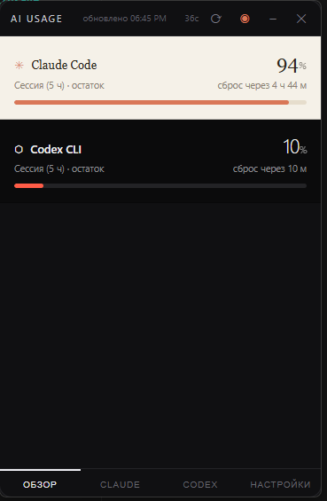
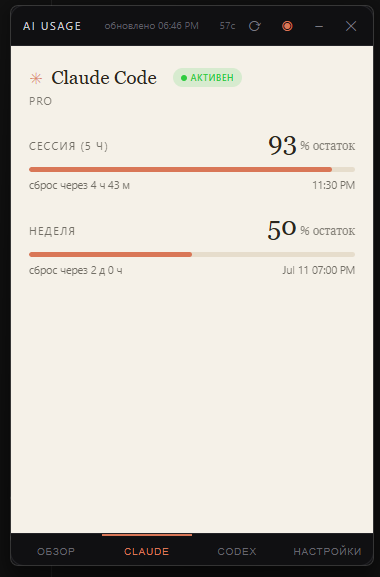
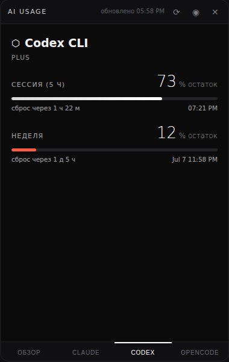
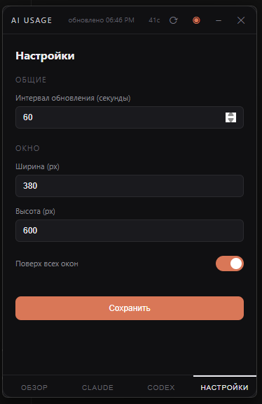

# AI Usage Widget for Windows — Claude Code & Codex CLI Usage Limit Tracker

A free, open-source Windows desktop widget for monitoring **Claude Code** and **Codex CLI** usage limits in real time. It shows 5-hour and weekly quotas, reset countdowns, account status, and usage percentages in an always-on-top window and the Windows system tray.

[](https://github.com/Trafalgardi/ai-usage-widget/releases/latest)
[](https://github.com/Trafalgardi/ai-usage-widget/releases/latest)
[](LICENSE)

**Download:** [Latest Windows release](https://github.com/Trafalgardi/ai-usage-widget/releases/latest)



## Claude Code and Codex usage monitor for Windows

AI Usage Widget helps Windows users track Claude Code and Codex CLI rate limits without repeatedly opening each CLI. It works as an always-on-top desktop widget and as a system tray quota monitor.

Use it as a:

- Claude Code usage widget for Windows
- Codex CLI usage tracker
- AI quota monitor
- Rate-limit and reset-time tracker
- Windows system tray usage monitor

## Features

### Overview

- Real-time usage limits for Claude Code and Codex CLI
- Current 5-hour session remaining
- Weekly usage remaining
- Reset date and countdown timer
- Plan and account status
- Additional model limits when available

### Screens

1. **Overview** — current 5-hour session remaining for both services with reset timer
2. **Claude** — session, weekly usage, and Opus weekly usage when available
3. **Codex** — session, weekly usage, plan, and additional model limits
4. **Settings** — refresh interval, window size, language, and always-on-top mode

### Status indicators

- **Active** — token is valid
- **Expiring** — less than one hour remains
- **Expired** — login is required
- **Red usage bar** — 85% or more of the limit has been consumed
- **Refresh countdown** — seconds until the next automatic update

### Windows system tray

Minimize the app to the Windows system tray while it continues updating in the background.

- Orange percentage icon — Claude Code
- Green percentage icon — Codex CLI
- Hover for detailed usage information
- Right-click to show, refresh, or exit

### Quick login

When a token expires, the widget displays a **Login via CLI** button and starts `claude auth login` or `codex login` in a separate window.

## Download and installation

### Recommended: Windows release

Download the latest packaged version from the [Releases page](https://github.com/Trafalgardi/ai-usage-widget/releases/latest).

### Run from source

Requirements:

- Windows 10 or Windows 11
- Python 3.10+
- WebView2 Runtime

Install dependencies:

```bash
pip install pywebview pystray Pillow
```

Run the widget:

```bash
python widget.py
```

Or double-click `start_widget.vbs` to launch without a console window.

### Start automatically with Windows

1. Press `Win+R`.
2. Enter `shell:startup`.
3. Add a shortcut to `start_widget.vbs` or the packaged executable.

## Screenshots






## Privacy and data sources

The widget sends requests only to the service endpoints used for retrieving account usage. Authentication tokens are read locally from the same credential files used by the official CLIs.

| Service | Local credential file | Usage endpoint |
|---|---|---|
| Claude Code | `~/.claude/.credentials.json` | `api.anthropic.com/api/oauth/usage` |
| Codex CLI | `~/.codex/auth.json` | `chatgpt.com/backend-api/wham/usage` |

You must already be logged in through each CLI using `/login`, `claude auth login`, or `codex login`.

The usage endpoints are undocumented and may change. If a card stops updating after a CLI update, open an issue with the error details.

## Settings

The Settings screen supports:

- Refresh interval: 15–600 seconds
- Window width: 200–800 px
- Window height: 300–1200 px
- Always-on-top mode
- Russian and English interface languages

Example `config.json`:

```json
{
  "language": "en",
  "refresh_interval_sec": 60,
  "window": {
    "width": 380,
    "height": 600,
    "on_top": true,
    "x": null,
    "y": null
  }
}
```

## Troubleshooting

### HTTP 401 or 403

The token has expired. Use **Login via CLI** or log in manually.

### Empty window

Install Microsoft Edge WebView2 Runtime. It is included with Windows 11 and most current Windows 10 installations.

### Red usage bar

The remaining quota is 15% or less.

### Python icon instead of the app icon

Restart the application. The icon is applied after window creation.

## Frequently asked questions

### What does AI Usage Widget track?

It tracks available Claude Code and Codex CLI usage limits, including session limits, weekly limits, reset times, and account status when exposed by the service.

### Is this an API cost tracker?

No. It focuses on subscription and CLI usage limits rather than API billing or token costs.

### Does it work on Windows 10 and Windows 11?

Yes. The app is intended for current Windows 10 and Windows 11 systems with WebView2 available.

### Does it upload my tokens anywhere?

The application reads the local CLI credential files and requests usage information from the relevant service endpoints. It does not require a separate account or external database.

### Is the project affiliated with Anthropic or OpenAI?

No. This is an independent open-source project and is not an official Anthropic or OpenAI product.

## Development

### Dependencies

- `pywebview` — WebView2-based window
- `pystray` — Windows system tray integration
- `Pillow` — tray icon generation

### Project structure

```text
usage-widget/
├── widget.py
├── ui.html
├── config.json
├── icon/
├── preview/
├── docs/
├── install.bat
└── start_widget.vbs
```

### Build a Windows executable

```bash
pip install pyinstaller
python -m PyInstaller --onefile --windowed --name="AI-Usage" --icon="icon/app.ico" --add-data "ui.html;." --add-data "icon/512.png;icon" --add-data "icon/app.ico;icon" --collect-all pywebview --collect-all pystray widget.py
```

## Website

The project website source is stored in [`docs/`](docs/) and is ready to be published with GitHub Pages.

## License

MIT
