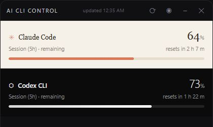
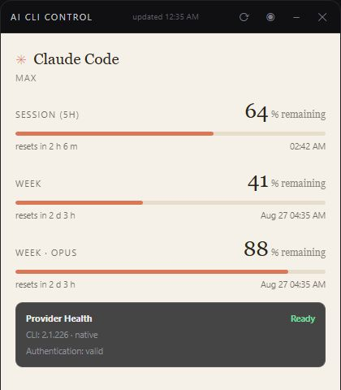
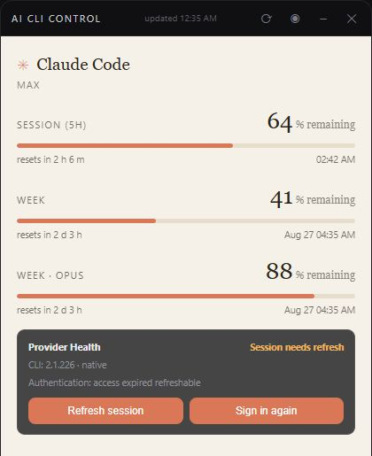
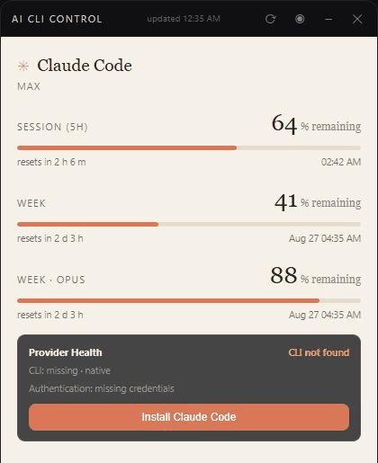

# AI CLI Control Center for Windows

> Install, diagnose, repair, and monitor Claude Code and OpenAI Codex CLI from one small Windows app.

[](https://github.com/Trafalgardi/ai-usage-widget/releases/latest)
[](https://github.com/Trafalgardi/ai-usage-widget/actions/workflows/tests.yml)
[](LICENSE)

AI CLI Control Center is an independent, open-source Windows companion for **Claude Code** and **OpenAI Codex CLI**. Provider Health detects whether each CLI is installed and working, checks sign-in metadata, identifies conflicting PATH copies, offers the appropriate recovery action, and keeps usage limits visible in the app and system tray.

**Download:** [AI CLI Control Center v2.0.0 for Windows](https://github.com/Trafalgardi/ai-usage-widget/releases/latest)



## From download to ready in 30 seconds

1. Download the release ZIP, verify `SHA256SUMS.txt`, and run `AI-CLI-Control-Center.exe`.
2. Open a provider card. Provider Health detects the CLI, its version, sign-in state, and PATH conflicts.
3. If needed, choose **Install**, **Refresh session**, or **Sign in**. Actions use the provider's official installer or discovered CLI executable.
4. Leave the Control Center open or minimize it to the tray to monitor session and weekly limits.

No separate project account is required. Windows may show a SmartScreen warning until release binaries are code-signed; verify the checksum and GitHub provenance before running an unsigned build.

## What it does

| Capability | Claude Code | Codex CLI |
|---|---:|---:|
| Discover PATH and known Windows installs | Yes | Yes |
| Probe CLI version and detect broken copies | Yes | Yes |
| Detect multiple PATH copies | Yes | Yes |
| Install using the official Windows script | Yes | Yes |
| Launch official CLI sign-in | Yes | Yes |
| Refresh an expired but recoverable session | User-triggered CLI probe | Sign in through Codex CLI |
| Session and weekly usage limits | Yes, when endpoint data is available | Yes, when endpoint data is available |
| Stale last-good usage during temporary failures | Yes | Yes |



## Provider Health and recovery

The app treats installation, authentication, and usage as separate health signals. A usage timeout does not automatically become a login error.

| State | Recommended action |
|---|---|
| CLI not found | Install with the provider's official Windows installer |
| CLI found but version probe fails | Review the detected copies and repair PATH/install |
| Credentials missing or unusable | Start the official CLI sign-in flow |
| Claude access session expired but refreshable | Run one explicit minimal Claude inference, then re-check metadata |
| Network/server/format failure | Retry while keeping the last successful usage snapshot |

The Claude refresh action can consume a very small amount of quota. The app never exchanges or writes OAuth refresh tokens itself.

<table>
  <tr><td></td><td></td></tr>
</table>



## More than a usage monitor

Traditional usage widgets answer “how much quota remains?” AI CLI Control Center also answers “is the CLI installed, which copy will Windows run, is the session recoverable, and what should I do next?” It remains deliberately focused on Claude Code and Codex CLI rather than adding broad provider coverage before these recovery flows are dependable.

## Privacy and trust

The app has no analytics, telemetry, advertising, project-operated backend, or account system. It reads the official CLIs' local credential files and sends usage requests directly to the corresponding provider. Tokens are not included in Provider Health snapshots and are not sent to this project.

- Claude credentials: `~/.claude/.credentials.json` or `~/.config/claude/.credentials.json`
- Codex credentials: `$CODEX_HOME/auth.json` or `~/.codex/auth.json`
- Claude usage: `api.anthropic.com/api/oauth/usage` (with the existing `claude.ai` fallback)
- Codex usage: `chatgpt.com/backend-api/wham/usage`
- Manual update check: GitHub Releases API; it does not download or replace the executable

See [PRIVACY.md](PRIVACY.md) for exact local files, registry changes, and network destinations, and [SECURITY.md](SECURITY.md) for reporting and security boundaries. This project is independent and is not affiliated with Anthropic or OpenAI.

## Troubleshooting

### CLI not found after installation

Restart the app so it inherits the latest PATH. Provider Health also checks known native, standalone, WinGet, and npm locations. If multiple working copies are detected, remove the obsolete PATH entry or reinstall the desired copy.

### Credentials missing or damaged

Do not edit token values in the Control Center. Choose **Sign in** to open the provider's official interactive login. Never attach `auth.json`, `.credentials.json`, or unsanitized logs to an issue.

### Usage unavailable but the CLI works

The usage endpoints are service-owned and may change. Network, rate-limit, server, and malformed-response errors are classified separately; the last good usage remains visible as stale data. Retry before signing in again.

### Empty window

Install or repair Microsoft Edge WebView2 Runtime. It is included with Windows 11 and most maintained Windows 10 installations.

### Windows SmartScreen warning

The current project does not yet publish a signed executable. Download only from GitHub Releases, compare SHA-256 with `SHA256SUMS.txt`, and verify provenance when available.

## Run from source

Requirements: Windows 10/11, Python 3.10–3.13, and WebView2.

```powershell
py -3.12 -m venv .venv
.\.venv\Scripts\python -m pip install -r requirements-build.txt
.\.venv\Scripts\python widget_v2.py
```

`widget_v2.py` remains the compatible entry point; `application.py` is the v2 composition root.

## Development and tests

```powershell
py -3.12 -m unittest discover -s tests -v
py -3.12 -m compileall -q .
```

Tests mock all network, installer, process, and credential behavior. See [CONTRIBUTING.md](CONTRIBUTING.md).

Key modules:

- `application.py` — composition root
- `provider_registry.py` — supported provider and action definitions
- `provider_health.py` / `auth_health.py` / `usage_health.py` — separate health signals
- `process_runner.py` — normalized, non-shell process execution
- `ui_contract.py` / `ui_bridge.py` — typed versioned WebView boundary
- `windows_integration.py` / `update_service.py` — startup and read-only update discovery

## Reproducible Windows build

```powershell
.\scripts\build.ps1
```

The script creates an isolated `.venv-build`, installs pinned dependencies, runs all tests, builds with the checked-in PyInstaller spec, smoke-starts the EXE, and creates:

- `dist/AI-CLI-Control-Center.exe`
- `dist/AI-CLI-Control-Center-v2.0.0-windows-x64.zip`
- `dist/SHA256SUMS.txt`

CI performs the same Windows build. The manual release-artifact workflow also creates a CycloneDX SBOM and GitHub build-provenance attestation; it does not publish a GitHub Release.

## Release status

See [CHANGELOG.md](CHANGELOG.md) for v2 notes and [RELEASE_CHECKLIST.md](RELEASE_CHECKLIST.md) for the owner-only publication, signing, GitHub metadata, and WinGet steps.

## License

[MIT](LICENSE)
