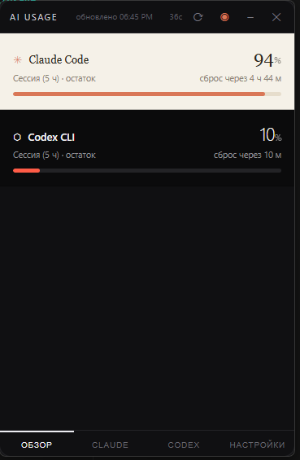
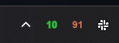
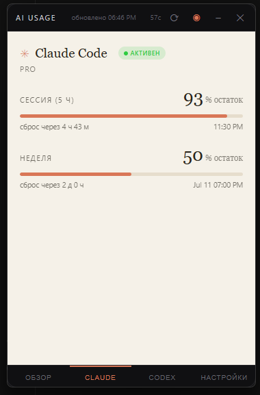
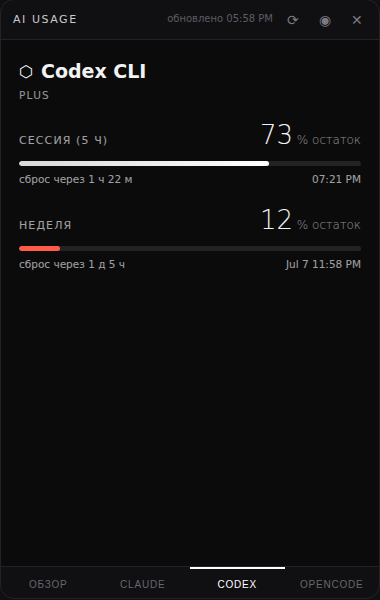
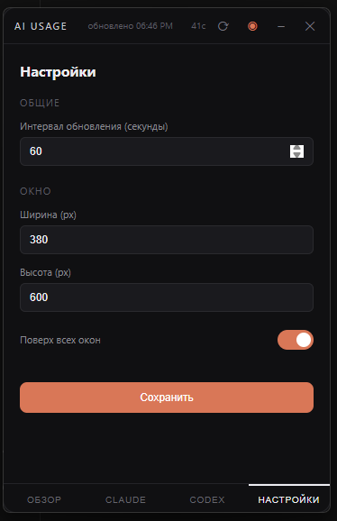

# AI Usage Widget — виджет лимитов для Windows 11

Небольшое всегда-поверх-окон окошко, которое показывает **остатки лимитов** для
Claude Code и Codex CLI в реальном времени.



## Возможности

### Основные экраны
1. **Обзор** — остаток текущей 5-часовой сессии по обоим сервисам с таймером сброса
2. **Claude** — сессия + неделя (и Opus-неделя, если есть) со временем сброса
3. **Codex** — сессия + неделя со временем сброса, план, доп. лимиты моделей
4. **Настройки** — интервал обновления, размер окна, режим "поверх всех окон", язык

### Индикаторы статуса
- **Статус токена** — цветной бейдж рядом с названием сервиса:
  -  Активен — токен валиден
  -  Истекает — осталось меньше часа
  -  Истёк — нужно залогиниться
- **Таймер обратного отсчёта** — показывает секунды до следующего обновления
- **Красная полоска** — остаток ≤ 15%

### Системный трей
При сворачивании в трей виджет продолжает работать в фоне. В трее появляются две иконки с процентами:
- **Оранжевые цифры** — Claude Code
- **Зелёные цифры** — Codex CLI



Наведи на иконку — увидишь тултип с подробной информацией. Правый клик:
- **Показать** — вернуть окно
- **Обновить** — запросить свежие данные
- **Выход** — полностью закрыть виджет

### Состояние provider'ов и восстановление
Точка входа v2 независимо определяет установку CLI, авторизацию и доступность usage. Она находит несколько Windows-установок, показывает выбранный executable и версию, сохраняет последние успешные данные при временной ошибке и получает рекомендованные действия из backend-state.

- CLI отсутствует → установка официальным installer'ом provider'а
- сессия Claude ещё refreshable → явный минимальный CLI probe до полного login
- credentials отсутствуют или непригодны → вход через найденный абсолютный путь CLI
- сеть, 429, 5xx или новый формат ответа → никогда не превращаются автоматически в Login

Claude repair запускается только пользователем: он выполняет один минимальный реальный inference и может потратить небольшую часть quota. Виджет не обменивает и не изменяет OAuth refresh token самостоятельно.

---

## Установка

1. Нужен **Python 3.10+**: https://python.org (при установке отметь *Add to PATH*)
2. В папке виджета:
   ```bash
   pip install pywebview pystray Pillow
   ```
3. Запуск:
   ```bash
   python widget_v2.py
   ```
   или двойной клик по **start_widget.vbs** — запустит без чёрного окна консоли

### Автозапуск при старте Windows

Нажми `Win+R` → `shell:startup` → скопируй туда **ярлык** на `start_widget.vbs`

---

## Скриншоты







### Управление окном
- **Перетаскивание** — за верхнюю панель
- **⟳** — обновить данные вручную
- **◉** — переключить режим "поверх всех окон"
- **⎯** — свернуть в трей
- **✕** — закрыть виджет

---

## Откуда берутся данные

Виджет ничего не отправляет наружу, кроме запросов к официальным серверам
самих сервисов. Токены читаются из тех же файлов, что используют CLI:

| Сервис | Токен | Эндпоинт |
|---|---|---|
| Claude Code | `~/.claude/.credentials.json` | `api.anthropic.com/api/oauth/usage` |
| Codex CLI | `~/.codex/auth.json` | `chatgpt.com/backend-api/wham/usage` |

Требование: быть залогиненным в каждом CLI (`/login` в Claude Code, `codex login`).

### Про эндпоинты

Оба эндпоинта — те же, что используют сами CLI и утилиты вроде CodexBar, но они
недокументированные и могут поменяться. Если карточка вдруг перестала обновляться
после апдейта CLI — напиши, поправим парсер (он и так принимает несколько
вариантов имён полей).

---

## Настройки

### Через интерфейс
Вкладка **Настройки** позволяет изменить:
- **Интервал обновления** — как часто опрашивать API (15-600 секунд)
- **Ширина окна** — 200-800 px
- **Высота окна** — 300-1200 px
- **Поверх всех окон** — вкл/выкл
- **Язык** — Русский / English

### Через config.json
```json
{
  "language": "ru",
  "refresh_interval_sec": 60,
  "window": {
    "width": 380,
    "height": 600,
    "on_top": true,
    "x": null,
    "y": null
  }
}
```

---

## Возможные проблемы

* **HTTP 401/403** — usage-запрос не прошёл авторизацию, но это ещё не означает обязательный полный login. Если сессия Claude refreshable, сначала используй «Обновить сессию»
* **Пустое окно** — не установлен WebView2 Runtime (на Windows 11 он есть по умолчанию; если нет — https://developer.microsoft.com/microsoft-edge/webview2/)
* **Красная полоска** — остаток ≤ 15%, пора готовиться к сбросу лимитов
* **Иконка Python вместо виджета** — перезапусти приложение, иконка применится после создания окна

---

## Разработка

### Зависимости
- **pywebview** — окно на базе WebView2
- **pystray** — иконки в системном трее
- **Pillow** — генерация иконок для трея

### Структура
```
usage-widget/
├── widget.py          # Бэкенд: API, парсинг, трей
├── widget_v2.py       # Provider Health entry point
├── provider_health.py # CLI discovery
├── auth_health.py     # Безопасная проверка auth metadata
├── usage_health.py    # Типизированные ошибки и last-good cache
├── provider_actions.py
├── session_repair.py
├── ui.html            # Фронтенд: интерфейс на HTML/CSS/JS
├── config.json        # Настройки (создаётся автоматически)
├── icon/
│   ├── 512.png        # Исходная иконка приложения
│   └── app.ico        # Windows-иконка (генерируется автоматически)
├── preview/           # Скриншоты для README
├── install.bat        # Установка зависимостей
└── start_widget.vbs   # Запуск без консоли
```

### Сборка EXE
```bash
pip install pyinstaller
python -m PyInstaller --onefile --windowed --name="AI-Usage" --icon="icon/app.ico" --add-data "ui.html;." --add-data "icon/512.png;icon" --add-data "icon/app.ico;icon" --collect-all pywebview --collect-all pystray widget_v2.py
```

### Лицензия
MIT
